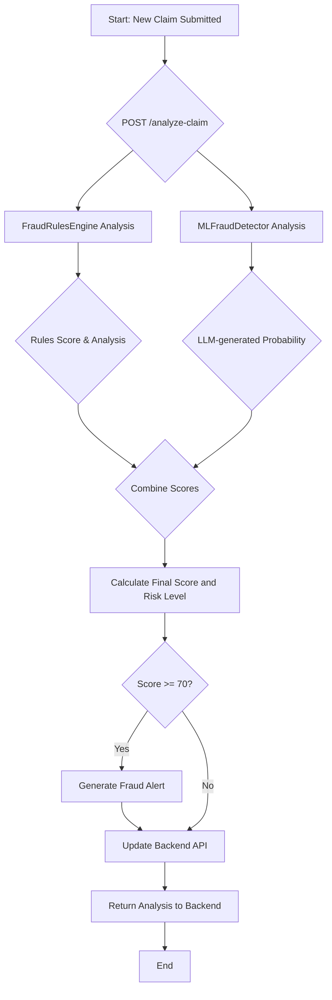

# CorruptGuard Fraud Detection Engine

**AI-powered fraud detection for government procurement**

CorruptGuard is a standalone Python service designed to detect and prevent corruption in government procurement processes. It uses a sophisticated combination of a rule-based engine and a Large Language Model (LLM) to analyze procurement claims and identify suspicious activities in real-time.

## Features

- **Hybrid Detection Approach:** Combines a powerful rule-based engine with an advanced LLM-based module for comprehensive fraud detection.
- **Real-time Analysis:** Analyzes procurement claims as they are submitted, providing immediate feedback and risk assessment.
- **Sophisticated Rule Engine:** Implements a wide range of fraud detection rules based on real-world corruption patterns, including financial anomalies, vendor behavior analysis, and timeline analysis.
- **LLM-powered Analysis:** Utilizes the `gemma3:4b` model running on Ollama to perform nuanced, context-aware fraud analysis, synthesizing inputs from the rules engine and historical data.
- **Comprehensive API:** Offers a set of RESTful API endpoints for claim analysis, statistics, and system health monitoring.
- **Detailed Explanations:** Provides clear and concise explanations for fraud scores, helping investigators understand the reasoning behind the alerts.

## Architecture

The CorruptGuard Fraud Detection Engine is composed of three main components:

1.  **FastAPI Application (`main.py`):** This is the main entry point of the service. It exposes a set of API endpoints for interacting with the fraud detection engine, handles request and response validation, and orchestrates the analysis process.

2.  **Fraud Rules Engine (`rules_engine.py`):** This component implements a set of predefined rules to detect common fraud patterns. It analyzes claims based on a variety of factors, including cost variance, round numbers, vendor history, and timeline anomalies.

3.  **Machine Learning Detector (`ml_detector.py`):** This module uses a dynamic Retrieval-Augmented Generation (RAG) pipeline to identify complex and subtle fraud patterns. It leverages the `gemma3:4b` Large Language Model (run via Ollama) to synthesize information from the rules engine's analysis and similar historical claims retrieved from a vector store.

The service works by first analyzing a claim with the rules engine, then feeding the results and other claim features into the machine learning module for a more in-depth, context-aware analysis. The final fraud score is generated by the LLM based on all available information.

## Workflow



## Installation

1.  **Set up Ollama:**
    - Install Ollama from [ollama.ai](https://ollama.ai/).
    - Pull the necessary models:
      ```bash
      ollama pull gemma3:4b
      ollama pull nomic-embed-text
      ```

2.  **Clone the repository:**
    ```bash
    git clone https://github.com/your-username/corruptguard.git
    cd corruptguard
    ```

3.  **Create and activate a virtual environment:**
    ```bash
    python3 -m venv venv
    source venv/bin/activate
    ```

4.  **Install the dependencies:**
    ```bash
    pip install -r requirements.txt
    ```

## Usage

First, ensure the Ollama application is running and the `gemma3:4b` and `nomic-embed-text` models are available.

To start the fraud detection engine, run the following command:

```bash
./start_fraud_engine.sh
```

This will start the FastAPI server on `http://localhost:8080`.

## API Endpoints

The following are the main API endpoints provided by the service:

-   `POST /analyze-claim`: Analyzes a procurement claim for fraud indicators.
-   `GET /claim/{claim_id}/score`: Retrieves the fraud score for a specific claim.
-   `GET /alerts/active`: Returns a list of active fraud alerts.
-   `GET /stats/fraud`: Provides comprehensive fraud detection statistics.
-   `GET /health`: Checks the health of the service.
-   `GET /`: Returns basic information about the service.

For detailed information about the API, including request and response models, please refer to the OpenAPI documentation available at `http://localhost:8080/docs`.

## Rules Engine

The rules engine (`rules_engine.py`) contains a set of `FraudRule` objects, each representing a specific fraud pattern. The engine analyzes a claim against these rules and calculates a fraud score based on the number and severity of the triggered rules. Its output (triggered flags and reasoning) is a critical input for the Machine Learning Module.

The main rules categories are:

-   **Financial Patterns:** Detects anomalies in the financial aspects of a claim, such as cost variance, round numbers, and budget maxing.
-   **Vendor Behavior:** Analyzes the behavior of the vendor, looking for patterns such as new vendors with high-value claims, unusual vendor frequency, and signs of shell companies.
-   **Timeline and Process:** Identifies suspicious timing patterns, such as rushed approvals and submissions outside of business hours.
-   **Geographic and Project:** Looks for mismatches between the vendor's location and the project area, and other signs of phantom projects.
-   **Document and Invoice:** Detects duplicate or anomalous invoices.

## Machine Learning Module

The machine learning module (`ml_detector.py`) has been upgraded to a hybrid, Retrieval-Augmented Generation (RAG) based approach for fraud detection. It no longer uses traditional classification models.

The new pipeline works as follows:

1.  **Dynamic RAG Pipeline:** For each incoming claim, a dynamic RAG pipeline is constructed on-the-fly.
2.  **Contextual Enhancement:** The pipeline is enhanced with the output from the `FraudRulesEngine`, providing the LLM with immediate, rule-based insights.
3.  **Retrieval-Augmented Generation (RAG):** Historical claims are embedded using `nomic-embed-text` and stored in a `FAISS` vector store. The pipeline retrieves similar historical claims to provide context for the new claim being analyzed.
4.  **LLM-based Synthesis:** The `gemma3:4b` model, running locally via Ollama, synthesizes the rules engine output, the retrieved historical context, and the new claim's details.
5.  **Fraud Probability Score:** The LLM's task is to act as an expert fraud analyst and produce a final fraud probability score based on all the provided information. This allows for a more nuanced and context-aware assessment than traditional models.

This hybrid approach combines the strengths of a deterministic rules engine with the advanced reasoning capabilities of a large language model.

## Dependencies

The project's dependencies are listed in the `requirements.txt` file. The main dependencies are:

-   `fastapi`: For building the API.
-   `uvicorn`: For running the FastAPI server.
-   `httpx`: For making asynchronous HTTP requests.
-   `ollama`: The official Python client for Ollama.
-   `langchain`: To build the RAG pipeline.
-   `langchain-ollama`: For Ollama integrations with LangChain.
-   `faiss-cpu`: For the vector store.
-   `numpy`: For numerical operations.
