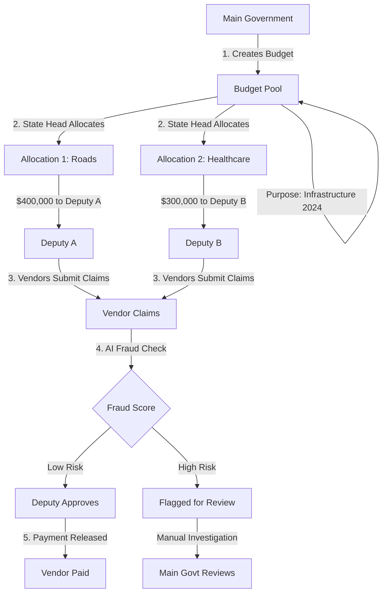

# 💰 H.E.L.I.X. Budget Allocation Flow

## Overview

The H.E.L.I.X. system uses a **hierarchical allocation model** with built-in fraud detection at every step.

## 🔄 The Allocation Process



## 📊 Step-by-Step Breakdown

### **Step 1: Budget Creation** (Main Government Only)

The Main Government creates a budget on the blockchain:

```solidity
function createBudget(uint256 _amount, string memory _purpose) 
    external onlyMainGovernment
```

**Example:**
- Amount: `$1,000,000`
- Purpose: `"Infrastructure Development 2024"`
- Status: `Active`
- Remaining: `$1,000,000` (initially)

**Smart Contract Logic:**
```solidity
budgets[budgetCount] = Budget({
    id: budgetCount,
    amount: _amount,           // Total budget
    purpose: _purpose,         // What it's for
    allocated: 0,              // Starts at 0
    remaining: _amount,        // Full amount available
    active: true,              // Can be allocated
    timestamp: block.timestamp
});
```

---

### **Step 2: Budget Allocation** (State Heads)

State Government officials allocate portions of the budget to specific areas and deputies:

```solidity
function allocateBudget(
    uint256 _budgetId,    // Which budget to use
    uint256 _amount,      // How much to allocate
    string memory _area,  // What area (e.g., "Roads")
    address _deputy       // Who manages it
) external onlyStateHead
```

**Example Allocation:**
- Budget ID: `1` (Infrastructure 2024)
- Amount: `$400,000`
- Area: `"Road Construction"`
- Deputy: `0x123...` (Deputy A)

**Smart Contract Checks:**
```solidity
require(budget.active, "Budget not active");
require(budget.remaining >= _amount, "Insufficient budget");

budget.allocated += _amount;    // Track allocated
budget.remaining -= _amount;    // Reduce remaining
```

**After Allocation:**
- Budget Total: `$1,000,000`
- Allocated: `$400,000`
- Remaining: `$600,000`

---

### **Step 3: Vendor Claims** (Vendors)

Vendors submit claims against allocations:

```solidity
function submitClaim(
    uint256 _budgetId,
    uint256 _allocationId,
    uint256 _amount,
    string memory _description,
    string memory _invoiceHash  // IPFS hash of invoice
) external onlyVendor
```

**Example Claim:**
- Budget ID: `1`
- Allocation ID: `1` (Road Construction)
- Amount: `$50,000`
- Description: `"Asphalt for Highway 101"`
- Invoice: `QmX...` (IPFS hash)

**Claim is sent to AI Fraud Detection:**
- Rule-based checks (duplicate vendors, unusual amounts, etc.)
- LLM analysis of description and invoice
- Fraud score: `0-100`

---

### **Step 4: Fraud Detection & Approval**

**AI Fraud Engine analyzes:**
- Vendor history
- Claim patterns
- Invoice authenticity
- Price reasonableness
- Duplicate detection

**If Low Risk (Score < 30):**
```solidity
function approveClaim(uint256 _claimId) external onlyDeputy {
    require(!claim.flagged, "Claim is flagged for fraud");
    claim.approved = true;
}
```

**If High Risk (Score > 70):**
```solidity
function flagClaim(uint256 _claimId, uint256 _fraudScore) 
    external onlyMainGovernment {
    claim.flagged = true;
    claim.fraudScore = _fraudScore;
}
```

---

### **Step 5: Payment & Transparency**

- Approved claims are paid to vendors
- All transactions recorded on Hedera blockchain
- Immutable audit trail
- Public transparency via Hashscan explorer

---

## 🎯 Key Features

### **1. Hierarchical Control**
```
Main Government (Creates Budgets)
    ↓
State Heads (Allocate to Areas)
    ↓
Deputies (Approve Claims)
    ↓
Vendors (Submit Claims)
```

### **2. Budget Tracking**
Every budget tracks:
- **Total Amount**: Original budget
- **Allocated**: How much has been allocated
- **Remaining**: What's still available
- **Active Status**: Can it still be used?

### **3. Fraud Prevention**
- AI checks every claim before approval
- Deputies can't approve flagged claims
- Main Government reviews high-risk claims
- All data immutable on blockchain

### **4. Transparency**
- Every transaction on public blockchain
- Real-time monitoring dashboard
- Audit trail for every rupee
- Public accountability

---

## 💡 Example Scenario

**Scenario:** Road Construction Project

1. **Main Govt** creates budget:
   - `$1M for "Infrastructure 2024"`

2. **State Head** allocates:
   - `$400K to "Road Construction" → Deputy A`
   - `$300K to "Healthcare" → Deputy B`
   - Remaining: `$300K`

3. **Vendor XYZ** submits claim:
   - `$50K for "Asphalt delivery"`
   - Invoice: `QmABC123...`

4. **AI Fraud Check**:
   - Checks vendor history ✅
   - Validates invoice ✅
   - Compares market prices ✅
   - **Fraud Score: 15** (Low Risk)

5. **Deputy A** approves claim:
   - Claim approved ✅
   - Payment released to Vendor XYZ
   - Transaction recorded on Hedera

6. **Public Transparency**:
   - Anyone can view on Hashscan
   - NGOs can monitor spending
   - Citizens can track their tax money

---

## 🔐 Security Features

### **Role-Based Access Control**
```solidity
modifier onlyMainGovernment() {
    require(msg.sender == mainGovernment, "Only Main Government");
    _;
}

modifier onlyStateHead() {
    require(stateHeads[msg.sender] || msg.sender == mainGovernment);
    _;
}

modifier onlyDeputy() {
    require(deputies[msg.sender] || stateHeads[msg.sender]);
    _;
}
```

### **Fraud Prevention**
- Claims can't be approved if flagged
- Claims can't be approved twice
- Budget can't be over-allocated
- All changes are immutable

---

## 📈 Data Structures

### **Budget**
```solidity
struct Budget {
    uint256 id;
    uint256 amount;      // Total budget
    string purpose;      // What it's for
    uint256 allocated;   // How much allocated
    uint256 remaining;   // What's left
    bool active;         // Can still allocate?
    uint256 timestamp;
}
```

### **Allocation**
```solidity
struct Allocation {
    uint256 id;
    uint256 budgetId;    // Which budget
    uint256 amount;      // How much
    string area;         // What area
    address deputy;      // Who manages
    uint256 timestamp;
}
```

### **Claim**
```solidity
struct Claim {
    uint256 id;
    uint256 budgetId;
    uint256 allocationId;
    address vendor;
    uint256 amount;
    string description;
    string invoiceHash;   // IPFS hash
    bool approved;
    bool paid;
    uint256 fraudScore;   // 0-100
    bool flagged;
    uint256 timestamp;
}
```

---

## 🚀 Try It Yourself

Once the contract is deployed, you can:

1. **Create a budget** (as Main Government)
2. **Allocate funds** (as State Head)
3. **Submit claims** (as Vendor)
4. **Monitor fraud scores** (AI detection)
5. **View on blockchain** (Hashscan explorer)

All of this happens through the H.E.L.I.X. frontend dashboard! 🎉
