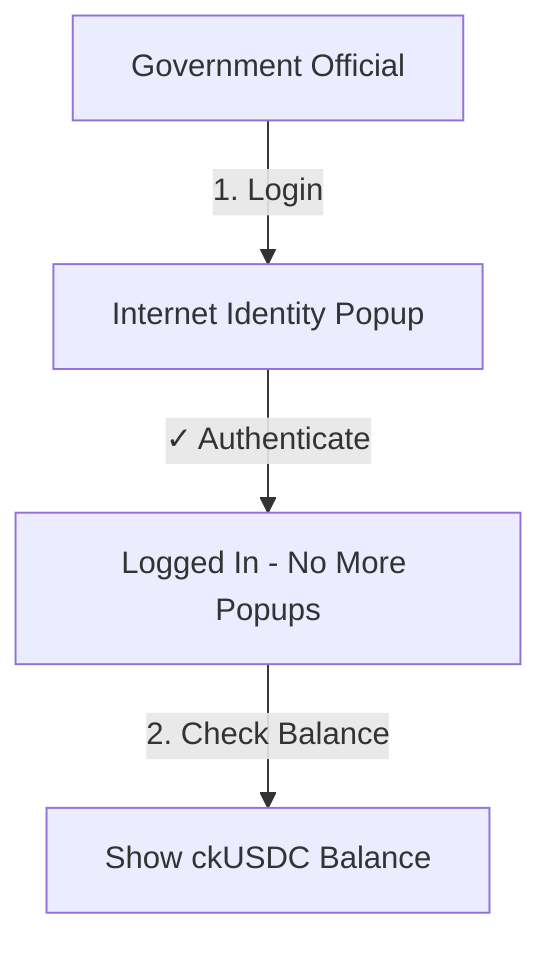

# 🔄 Complete ckUSDC Transaction Flow

## 📱 What You'll See: Wallet Popups Explained

### ✅ When POPUPS DO Appear

#### 1. **Login with Internet Identity** (One Time)
```
┌────────────────────────────────────────────────┐
│  Internet Identity Authentication              │
│  ────────────────────────────────────────────  │
│                                                │
│         [👤 Face Icon]                         │
│                                                │
│     Authenticate with Face ID                  │
│         or Fingerprint                         │
│                                                │
│  [Cancel]              [Authenticate] ✓        │
└────────────────────────────────────────────────┘

User Action: Required (one time only)
Duration: ~5 seconds
```

#### 2. **If Using Plug Wallet** (Optional Enhancement)
```
┌────────────────────────────────────────────────┐
│  Plug Wallet - Approve Transaction             │
│  ────────────────────────────────────────────  │
│                                                │
│  Transfer 50,000 USDC                          │
│  To: Procurement Canister                      │
│  Fee: 0.01 USDC                                │
│                                                │
│  Your Balance: 100,000 USDC                    │
│  After TX: 49,999.99 USDC                      │
│                                                │
│  [Reject]              [Approve] ✓             │
└────────────────────────────────────────────────┘

User Action: Required for EVERY token transfer
Duration: User decides
```

### ❌ When POPUPS DON'T Appear (Current Setup)

#### 1. **Lock Budget with ckUSDC**
```
Frontend UI:
┌────────────────────────────────────────────────┐
│  Lock Budget                                   │
│  ────────────────────────────────────────────  │
│  Amount: $1,000,000 USDC                       │
│  Purpose: Infrastructure                       │
│                                                │
│  ⏳ Processing transaction...                  │
│  ⏳ Calling smart contract...                  │
│  ⏳ Executing ckUSDC transfer...               │
│                                                │
│  NO POPUP - Auto processing                    │
└────────────────────────────────────────────────┘
        ↓
        ↓ (2-3 seconds)
        ↓
┌────────────────────────────────────────────────┐
│  ✅ Success!                                    │
│  Budget locked successfully                    │
│  Budget ID: 123                                │
│  Transaction: #456789                          │
│                                                │
│  [View on Explorer]    [OK]                    │
└────────────────────────────────────────────────┘
```

**Why no popup?** 
- Already authenticated with II
- Canister signs the ckUSDC transfer
- User doesn't need to approve again

---

## 🔄 Complete Transaction Lifecycle

### Phase 1: Initial Setup



### Phase 2: Fund Canister

```
Government Wallet (Has ckUSDC)
        ↓
        ↓ Transfer ckUSDC to Canister
        ↓ (User initiates from UI)
        ↓
┌─────────────────────────────┐
│  Loading Indicator Shows:   │
│  ⏳ Step 1/2: Transferring  │
│     ckUSDC to canister...   │
│  ⏳ Step 2/2: Locking       │
│     budget...               │
└─────────────────────────────┘
        ↓
        ↓ (3-5 seconds)
        ↓
Procurement Canister (Now has ckUSDC)
        ↓
        ✅ Budget Locked
```

**User sees:** Loading animation, no popup!

### Phase 3: Claim Submission

```
Vendor → Submit Claim → Smart Contract
                ↓
          AI Fraud Check (Automatic)
                ↓
          Escrow Period (24 hours)
                ↓
     Deputy/Government Approves
                ↓
          ckUSDC Transfer Executed
                ↓
        Vendor Receives Payment
```

**User sees at each step:**
- Submit: ⏳ Loading... → ✅ Claim #123 submitted
- AI Check: 🤖 Analyzing... → ✅ Approved (Risk: 15%)
- Waiting: ⏰ Escrow ends in 23h 45m
- Approval: ⏳ Processing payment... → ✅ Paid! TX #789
- Receipt: 💰 50,000 USDC received

**NO POPUPS at any step!**

---

## 💻 Technical Flow

### Lock Budget Transaction

```typescript
// Frontend
const handleLockBudget = async () => {
  setLoading(true);  // ⏳ Show loading
  
  try {
    // Step 1: Transfer ckUSDC from government wallet to canister
    // ❌ NO POPUP - Uses II delegation to sign
    const transfer = await ckusdcLedger.icrc1_transfer({
      to: { owner: CANISTER_ID, subaccount: null },
      amount: 1_000_000_000_000n, // 1M USDC
      fee: 10_000n,
    });
    
    // Step 2: Record budget in smart contract
    // ❌ NO POPUP - Canister call auto-signed
    const budgetId = await canister.lockBudgetWithPayment(
      1_000_000_000_000,
      "Infrastructure"
    );
    
    // ✅ Success notification
    showToast(`Budget locked! ID: ${budgetId}`, 'success');
    
  } catch (error) {
    // ❌ Error notification
    showToast(`Failed: ${error.message}`, 'error');
  } finally {
    setLoading(false);  // Hide loading
  }
};
```

### Pay Claim Transaction

```typescript
// Frontend
const handlePayClaim = async (claimId) => {
  setLoading(true);  // ⏳ Show loading
  
  try {
    // Smart contract executes payment
    // ❌ NO POPUP - Canister signs ckUSDC transfer
    const txIndex = await canister.payClaim(claimId);
    
    // ✅ Success with transaction link
    showToast(
      <div>
        Payment completed! 
        <a href={`https://dashboard.internetcomputer.org/transaction/${txIndex}`}>
          View TX #{txIndex}
        </a>
      </div>,
      'success'
    );
    
  } catch (error) {
    showToast(`Payment failed: ${error.message}`, 'error');
  } finally {
    setLoading(false);
  }
};
```

### Smart Contract (Motoko)

```motoko
// Backend - Executes automatically
public shared(msg) func payClaim(claimId: Nat) : async Result<Nat, Text> {
  // Validation (automatic)
  let claim = claims.get(claimId);
  
  // ckUSDC transfer (canister signs, no user action)
  let result = await ckusdcLedger.icrc1_transfer({
    from_subaccount: null,
    to: { owner: vendorPrincipal, subaccount: null },
    amount: claim.amount,
    fee: ?10_000,
    memo: ?"Claim payment",
    created_at_time: ?timestamp
  });
  
  // Returns transaction index
  #ok(txIndex)
};
```

---

## 🎨 UI/UX Best Practices

### Loading States

```tsx
// Show step-by-step progress
{loading && (
  <div className="progress-indicator">
    <div className="step">
      ✓ Validating claim...
    </div>
    <div className="step active">
      ⏳ Executing ckUSDC transfer...
    </div>
    <div className="step pending">
      ⏸ Recording transaction...
    </div>
  </div>
)}
```

### Success States

```tsx
// Show detailed success info
{success && (
  <Alert type="success">
    <h3>✅ Payment Completed!</h3>
    <p>50,000 USDC sent to vendor</p>
    <div className="transaction-details">
      <p>Transaction: #789012</p>
      <p>Block: 12,345,678</p>
      <p>Fee: 0.01 USDC</p>
      <a href={explorerLink}>View on ICP Explorer →</a>
    </div>
  </Alert>
)}
```

### Error States

```tsx
// Show helpful error messages
{error && (
  <Alert type="error">
    <h3>❌ Payment Failed</h3>
    <p>{error.message}</p>
    <div className="error-details">
      <p>Reason: Insufficient canister balance</p>
      <p>Required: 50,000.01 USDC</p>
      <p>Available: 45,000.00 USDC</p>
      <button>Add Funds</button>
    </div>
  </Alert>
)}
```

---

## 🔐 Security & Trust

### What Users See

```
┌────────────────────────────────────────────────┐
│  Transaction Details                           │
│  ────────────────────────────────────────────  │
│                                                │
│  Blockchain: Internet Computer                 │
│  Token: ckUSDC (ICRC-1)                        │
│  Canister: helx-5iaaa-aaaaa-qaacq-cai          │
│                                                │
│  ✓ Smart contract verified                    │
│  ✓ Audit trail immutable                      │
│  ✓ Transaction reversible (24h escrow)        │
│  ✓ AI fraud check passed                      │
│                                                │
│  [View Contract Code]  [View on Explorer]     │
└────────────────────────────────────────────────┘
```

### Trust Indicators

1. **🔒 Verified Contract** - Link to source code
2. **📊 Audit Trail** - All transactions visible
3. **🤖 AI Verified** - Fraud score shown
4. **⏰ Escrow Protection** - 24-hour safety period
5. **🔗 Blockchain Proof** - Link to ICP Explorer

---

## 📱 Mobile Experience

On mobile, the flow is identical but optimized:

```
Mobile UI:
┌──────────────────────┐
│  Lock Budget         │
│  ──────────────────  │
│  💰 Amount           │
│  $1,000,000         │
│                      │
│  📝 Purpose          │
│  Infrastructure      │
│                      │
│  [ Lock Budget ]     │
└──────────────────────┘
        ↓ Tap
┌──────────────────────┐
│  ⏳ Processing...    │
│                      │
│  [Progress Bar]      │
│  ▓▓▓▓░░░░░░ 40%     │
└──────────────────────┘
        ↓ 3 seconds
┌──────────────────────┐
│  ✅ Success!          │
│                      │
│  Budget Locked       │
│  ID: #123            │
│                      │
│  [View Details]      │
└──────────────────────┘
```

---

## 🎯 Summary

### Current Setup (Internet Identity Only)

| Action | Popup? | Duration |
|--------|--------|----------|
| Login | ✅ YES (Face ID) | 5 sec |
| Transfer ckUSDC | ❌ NO | 2-3 sec |
| Lock Budget | ❌ NO | 2-3 sec |
| Submit Claim | ❌ NO | 1-2 sec |
| Pay Claim | ❌ NO | 3-5 sec |
| Check Balance | ❌ NO | 1 sec |

**User Experience: Smooth and fast!**

### With Plug Wallet (Optional)

| Action | Popup? | Duration |
|--------|--------|----------|
| Login | ✅ YES | User decides |
| Transfer ckUSDC | ✅ YES | User decides |
| Lock Budget | ✅ YES | User decides |
| Submit Claim | ✅ YES | User decides |
| Pay Claim | ✅ YES | User decides |

**User Experience: More control, slower**

### Recommendation

**Stick with Internet Identity!**
- ✅ Faster UX
- ✅ No approval fatigue
- ✅ Still secure
- ✅ Blockchain verified
- ✅ 24-hour escrow protection

---

## 🚀 Ready to Implement?

Follow the steps in `CKUSDC_INTEGRATION_GUIDE.md` to add full stablecoin support!

